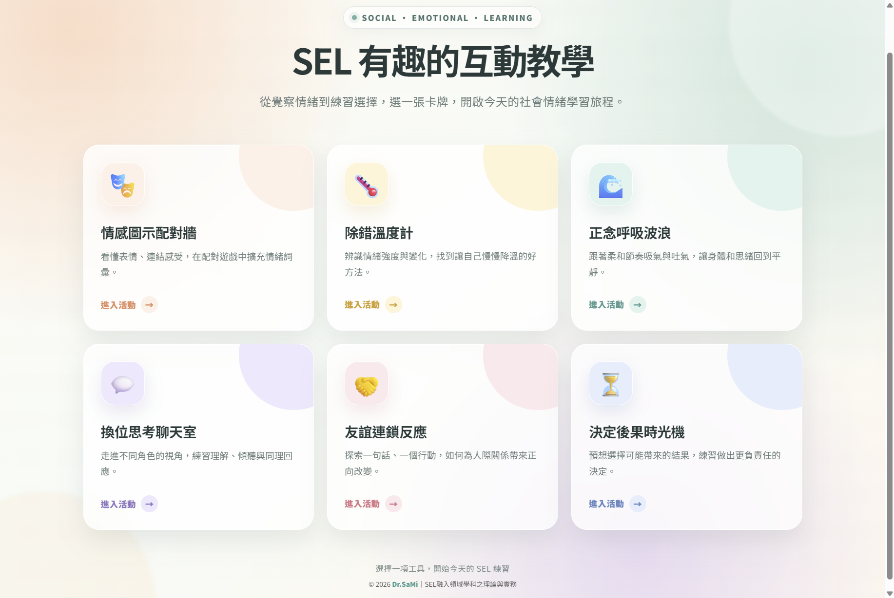

# SEL 有趣的互動教學

6個SEL互動軟體，可下載離線使用。專為「SEL融入領域學科之理論與實務」專書設計。  

<!-- 常見徽章（可依專案替換或移除） -->

<!-- 視覺預覽（截圖 / GIF / 短影片）-->

## 功能特色與對應程式

- SEL 有趣的互動教學｜六個互動教學目錄。（https://samichen.github.io/sel/index.html ）
- 情感圖示配對牆｜自我覺察：將校園情境描述與十種情緒圖示進行配對，辨識如驚訝與驚恐等較細緻的情緒差異，並練習進行情緒標記。（https://samichen.github.io/sel/selwall.htm ）
- 除錯溫度計｜自我管理。學生在程式設計卡關時，自主記錄當下情緒狀態，以及所採取的情緒調節方式。（https://samichen.github.io/sel/debugThermometer.htm ）
- 正念呼吸波浪｜自我管理：配合畫面波浪的擴張與收縮節奏練習吸氣與呼氣，背景色隨節奏準確度由紅轉藍，以視覺化節奏引導學生練習呼吸與情緒調節。（https://samichen.github.io/sel/selwaves.htm ）
- 換位思考聊天室｜社會覺察：於模擬通訊介面回應帶有情緒的訊息，「同理心溫度計」即時顯示回覆對他人感受的影響，情境結束後並提供教育心理學觀點之反思總結。（https://samichen.github.io/sel/chatroom.htm ）
- 友誼連鎖反應｜人際關係技巧：以分享、傾聽、讚美等社交行為修補人際網絡的斷裂連線，全網絡連通時畫面轉亮，具象化正向行為的社會傳遞效應。（https://samichen.github.io/sel/friendship.htm ）
- 決定後果時光機｜負責任的決策：自三十個校園生活情境中選擇行動，透過「快轉」功能檢視一週後可能產生的結果，並可回溯比較不同決定，引導學生思考各項選擇可能帶來的後果。（https://samichen.github.io/sel/timemachine.htm ）

## 快速開始

### 環境需求

- 跨平台；電腦、行動載具皆可。
- 不需安裝任何套件。直接瀏覽器開啟使用。
- 可下載 html 離線使用。

## 授權

本專案採用 [創用CC] 授權條款釋出。
